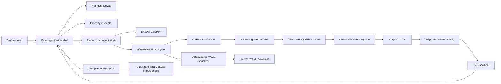
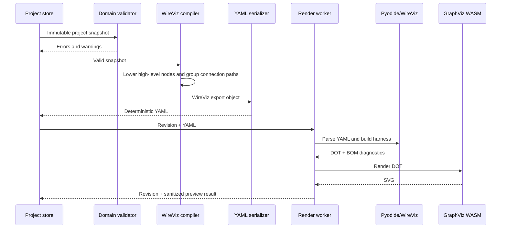

# WireViz GUI Architecture

**Status:** Implemented MVP
**Date:** 2026-07-23
**Initial target:** WireViz 0.4.1
**Deployment target:** Static GitHub Pages site
**Primary platform:** Desktop web browsers

## 1. Purpose

This document defines the architecture for a browser-based visual editor that creates WireViz-compatible YAML for wiring harness documentation. The editor should feel closer to a wire-harness configurator than a text editor: users place connectors, cables, bundles, splices, and junctions on a canvas; connect pins and conductors; edit properties; preview the resulting WireViz diagram; and download the generated YAML.

The initial application has no server-side component. All project data and rendering stay in the user's browser. It can be deployed as static assets on GitHub Pages.

## 2. Product decisions

The following decisions are confirmed for the initial release:

| Area | Initial decision | Future direction |
|---|---|---|
| Editor | Visual canvas with property inspector | Add a synchronized wire-list/table editor |
| YAML | Generate and download new WireViz YAML | Import and edit existing YAML |
| Preview | Run vendored WireViz in WebAssembly and render in-browser | Continue tracking upstream WireViz compatibility |
| Harness scope | Connectors, wires, cables, bundles, splices, junctions, shields, loops/jumpers, labels, colors, BOM fields, and metadata | Add less-common upstream features as needed |
| Component library | Generic and user-authored components; library import/export | Curated manufacturer libraries |
| Project storage | Current browser session plus YAML download | Project files, autosave, IndexedDB, and local file access |
| GitHub | GitHub Pages deployment only | Optional repository integration |
| Offline | Not required | Installable offline PWA |
| Devices | Desktop only | Tablet and responsive/mobile support |
| Frontend | React and TypeScript | Revisit only if implementation evidence requires it |

## 3. Goals

The initial release must:

1. Provide a desktop-oriented visual canvas for harness construction.
2. Make pins and conductors explicit so incorrect terminations are difficult to create.
3. Support all agreed WireViz concepts without making users understand WireViz YAML syntax.
4. Generate deterministic, human-readable WireViz YAML.
5. Validate the harness before download and explain errors in terms of canvas objects.
6. Produce a live WireViz-derived SVG preview entirely in the browser.
7. Import and export reusable generic connector/component libraries.
8. Deploy as static files on GitHub Pages with no API, database, account, or telemetry requirement.
9. Keep a strict boundary between the editor's domain model and WireViz's evolving input format.

## 4. Non-goals for the initial release

The initial release will not:

- Import arbitrary WireViz YAML.
- Preserve YAML comments, anchors, aliases, templates, or hand-authored formatting.
- Save or reopen full editor projects.
- Autosave to browser storage.
- Integrate directly with GitHub repositories.
- Include real manufacturer connector catalogs.
- Provide real-time pricing, quoting, ordering, or inventory.
- Replace electrical CAD, perform circuit simulation, or verify current/voltage suitability.
- Model physical 3D routing, bend radius, branch lengths, or manufacturing board geometry.
- Run the normal WireViz CLI or a native GraphViz executable on the user's machine.
- Guarantee that the visual canvas layout will match the auto-layout of the WireViz preview.

Because project import and persistence are deferred, refreshing or closing the initial application can discard the editable canvas state. The UI must make this limitation clear before destructive navigation and make YAML download prominent. Downloaded YAML is a valid WireViz artifact, but it will not be re-importable until the future YAML-import feature is implemented.

## 5. Architecture drivers

### 5.1 Static deployment

GitHub Pages can only serve static files. The complete runtime—including the editor, Python runtime, vendored WireViz source, Python dependencies, and GraphViz WebAssembly—must therefore be downloadable browser assets.

### 5.2 WireViz compatibility

WireViz's public syntax and implementation may change. The GUI must not use WireViz-shaped YAML objects as its application state. A versioned export adapter will translate the stable GUI model to one pinned WireViz version.

### 5.3 Multi-conductor topology

A cable cannot be represented as a single ordinary canvas edge because it can contain many individually terminated conductors plus a shield. Connectors and cables are both canvas nodes. Thin termination links connect a connector pin to a cable conductor. This mirrors WireViz's alternating connector/cable connection structure and keeps each conductor selectable.

### 5.4 Browser runtime isolation

Python startup and graph layout are relatively heavy and must not block canvas interaction. WireViz parsing and GraphViz rendering run in a dedicated Web Worker. The main thread owns only the editor UI and application state.

### 5.5 Safe output

Labels and notes are user-controlled and eventually reach YAML, DOT, and SVG. Input must be treated as untrusted. Generated SVG must be sanitized before insertion into the application DOM.

## 6. Recommended system architecture



The application has three important model boundaries:

1. **Editor domain model:** the authoritative, ergonomic representation used by the canvas.
2. **WireViz export model:** a WireViz-version-specific object generated from the domain model.
3. **Rendered artifact:** DOT/SVG produced from the export model by the vendored runtime.

The editor never derives its own authoritative state from the SVG preview.

## 7. Technology choices

| Concern | Recommended choice | Rationale |
|---|---|---|
| Language | TypeScript with strict mode | Safer cross-layer domain contracts |
| UI | React | Mature ecosystem and suitable component/state composition |
| Build | Vite | Simple static build, workers, WebAssembly assets, and GitHub Pages support |
| Canvas | `@xyflow/react` | Custom nodes, ports/handles, selection, zoom, pan, and keyboard interaction |
| State | Zustand with Immer and a command history layer | Low ceremony, selective subscriptions, undo/redo support |
| Runtime validation | Zod | Shared TypeScript/runtime contracts for projects and libraries |
| YAML | `yaml` npm package | Deterministic generation now and a CST/document path for future comment-preserving import |
| Python/WASM | Pinned, locally bundled Pyodide | Runs WireViz Python without a backend |
| Graph layout | `@viz-js/viz` or an equivalent pinned GraphViz WASM distribution | Converts WireViz-generated DOT to SVG without a native executable |
| SVG sanitization | DOMPurify configured for SVG | Prevents user text from becoming active markup |
| Testing | Vitest, React Testing Library, Playwright | Unit, component, and end-to-end coverage |
| Formatting/linting | ESLint and Prettier | Consistent TypeScript and React code |

Dependencies must be pinned through the package lock. The WireViz source and WebAssembly runtime must be pinned by exact version and commit/checksum in a machine-readable vendor manifest.

## 8. Domain model

### 8.1 Design principle

The domain model describes what the user means, not how WireViz happens to encode it. Splices and junctions are first-class editor objects even if the WireViz adapter must compile them into synthetic connectors and loops.

Every entity has two identities:

- An immutable internal UUID used by application references.
- A user-visible designator such as `J1`, `W1`, or `S1`, unique within its relevant WireViz namespace.

Renaming a designator therefore does not break internal references.

### 8.2 Core aggregate

```ts
interface HarnessProject {
  schemaVersion: 1;
  id: string;
  metadata: HarnessMetadata;
  components: Record<EntityId, HarnessComponent>;
  links: Record<EntityId, TopologyLink>;
  additionalBomItems: AdditionalBomItem[];
  libraryReferences: LibraryReference[];
  view: CanvasViewState;
}

type HarnessComponent =
  | ConnectorInstance
  | CableInstance
  | SpliceInstance
  | JunctionInstance;
```

`view` contains canvas positions, selection-independent display choices, and viewport state. It is not exported to WireViz YAML. It exists now so future project persistence does not require a domain redesign.

### 8.3 Connector

A connector contains:

- Designator, type, subtype, color, and notes.
- Ordered pins with stable IDs, displayed pin numbers, labels, and optional pin colors.
- Optional connector-internal loops/jumpers.
- BOM fields: internal part number, manufacturer, manufacturer part number, supplier, supplier part number, and ignore-in-BOM.
- Optional additional components, such as contacts, seals, backshells, and heat shrink.
- WireViz presentation flags that are meaningful to users, such as hiding disconnected pins.

Pins are objects, not parallel arrays. Parallel `pins`, `pinlabels`, and `pincolors` arrays are created only by the WireViz export adapter.

### 8.4 Cable, individual wire, bundle, and shield

`CableInstance` represents all conductor-bearing spans:

- `kind`: `cable`, `wire`, or `bundle`.
- Designator, type, gauge, length, notes, and BOM fields.
- An ordered list of conductor objects.
- Optional shield conductor.
- Optional color-code generator configuration.

Each conductor contains:

- Stable ID and ordinal.
- Wire color or striped color code.
- Wire label/signal name.
- Optional per-conductor overrides where WireViz can represent them.
- Up to two direct termination links in the normal case.

An individual wire is a cable with one conductor at the domain boundary. A bundle compiles to a WireViz cable with `category: bundle`.

### 8.5 Splices and junctions

Both are explicit canvas nodes:

- A **splice** represents an electrical join among conductors, usually compact and inline.
- A **junction** represents a branch point or terminal/distribution point and may have a visible designator and BOM properties.

Each exposes ordered ports and a connectivity rule. The ordinary rule is that all ports are electrically common. Future versions can add isolated groups within a junction.

WireViz does not provide a stable, dedicated high-level splice entity in the target release. The export adapter will compile these nodes into a tested combination of synthetic connector pins and connector loops. Generated designators and attributes must be deterministic. This encoding is an implementation risk and must be proven in the WebAssembly spike before the full editor is built.

### 8.6 Topology links

```ts
type PortRef =
  | { componentId: EntityId; kind: "connector-pin"; pinId: EntityId }
  | { componentId: EntityId; kind: "conductor"; conductorId: EntityId }
  | { componentId: EntityId; kind: "shield" }
  | { componentId: EntityId; kind: "splice-port"; portId: EntityId }
  | { componentId: EntityId; kind: "junction-port"; portId: EntityId };

interface TopologyLink {
  id: EntityId;
  a: PortRef;
  b: PortRef;
  kind: "termination" | "mate";
}
```

The graph validator restricts which port types can be linked. Normal termination paths alternate between connector-like and cable-like entities. Direct connector mating is represented separately and compiled to WireViz arrow syntax.

## 9. Canvas and interaction architecture

### 9.1 Layout

The desktop workspace has four regions:

1. **Top command bar:** new harness, undo/redo, validate, download YAML, and preview status.
2. **Left palette/library:** connector, cable, wire, bundle, splice, and junction templates.
3. **Center canvas:** visual topology editor.
4. **Right inspector:** properties of the selected object, pin, conductor, link, or project.

The preview is a resizable lower or side panel so users can compare the editable topology with the authoritative WireViz output.

### 9.2 Node behavior

- Connector nodes show pin handles in pin order.
- Cable and bundle nodes show conductor handles on both sides and a distinct shield handle.
- Splice and junction nodes show a configurable number of ports.
- Handles carry stable port references, not display labels.
- Invalid link targets are disabled while dragging.
- Completed links are validated immediately.
- Double-clicking a node opens its inspector; pressing Delete invokes a dependency-aware delete command.

### 9.3 Commands and history

All meaningful edits are commands, for example:

- Add/move/delete component.
- Add/delete/reconnect topology link.
- Add/remove/reorder pin or conductor.
- Change a property.
- Apply a library template.
- Add/remove loop.

Commands update one store transaction and provide an inverse for undo. Pointer movement is coalesced into one history entry per completed drag. Preview results and transient selection are excluded from command history.

### 9.4 Deletion rules

Deleting an object with terminations requires confirmation and reports the number of affected links. Deleting a pin or conductor is blocked until its links are removed or the user explicitly accepts cascading link removal.

## 10. Component library

The initial library contains only generic templates such as:

- Generic 1–N pin connector.
- Generic sealed/unsealed connector.
- Single wire.
- Multi-conductor cable.
- Bundle.
- Splice.
- Junction.

Library files use a GUI-owned, versioned JSON format, tentatively named `*.wireviz-library.json`. JSON is used instead of WireViz YAML because a reusable template includes editor defaults and library metadata that do not belong in a harness export.

```ts
interface ComponentLibraryFile {
  format: "wireviz-gui-component-library";
  schemaVersion: 1;
  library: {
    id: string;
    name: string;
    description?: string;
    version: string;
  };
  templates: ComponentTemplate[];
}
```

Import processing must:

1. Parse JSON without executing code.
2. Check file size and schema version.
3. Validate every template with Zod.
4. Reject duplicate template IDs within the file.
5. Show an import summary and conflicts before applying changes.

Templates are copied into the current project when instantiated. Existing harness objects do not silently change when a library is replaced.

## 11. WireViz export pipeline

### 11.1 Pipeline



### 11.2 Mapping

| Domain concept | WireViz output |
|---|---|
| Connector | Entry in `connectors` |
| Ordered connector pins | `pins`, `pinlabels`, and `pincolors` arrays |
| Cable or individual wire | Entry in `cables`; a wire has `wirecount: 1` |
| Bundle | Cable entry with `category: bundle` |
| Conductors | `wirecount`, `colors`, and `wirelabels` |
| Shield | Cable `shield` plus a shield connection using the WireViz shield designator |
| Pin loop/jumper | Connector `loops` |
| Splice/junction | Synthetic connector/loop structure generated by the versioned adapter |
| Terminations | Grouped WireViz `connections` lists |
| Direct mate | WireViz arrow/mating form |
| BOM properties | Connector/cable product fields and `additional_components` |
| Extra BOM line | `additional_bom_items` |
| Harness title/revision/company | `metadata` |
| Render preferences | Supported `options`; advanced raw `tweak` is not exposed initially |

### 11.3 Connection compilation

The domain stores individual links; WireViz prefers connection sets containing aligned arrays. The compiler will:

1. Lower splice and junction objects into WireViz-compatible connector-like structures.
2. Traverse valid connected paths through alternating connector-like and cable-like components.
3. Produce a normalized scalar connection for each conductor path.
4. Group paths that share the same ordered component sequence.
5. Emit aligned pin/conductor arrays for each group.
6. Sort groups deterministically by natural designator and port order.

This algorithm lives in a pure TypeScript package with no React dependencies. It can therefore be exhaustively tested with graph fixtures.

### 11.4 Deterministic YAML

The serializer will:

- Emit sections in the order `metadata`, `options`, `connectors`, `cables`, `connections`, `additional_bom_items`.
- Natural-sort component designators while preserving explicit pin and conductor order.
- Use block-style YAML for readability.
- Quote ambiguous scalar values such as `on`, `off`, numeric-looking part numbers, and color strings where required.
- Avoid anchors, aliases, custom YAML tags, and app-private top-level fields.
- Include a short generated-file comment naming the GUI and targeted WireViz version.
- Normalize line endings to LF and finish with one newline.

The downloaded filename is derived from a sanitized project title and ends in `.yml`.

## 12. Validation architecture

Validation occurs in layers so the user receives fast, specific feedback.

### 12.1 Field validation

Runs synchronously in the inspector:

- Required names and designators.
- Valid pin and conductor counts.
- Supported color codes.
- Gauge and length formatting.
- BOM field types.
- Duplicate displayed pin numbers.

### 12.2 Domain validation

Runs after each command:

- Unique connector and cable designators.
- References point to existing entities.
- Allowed port-type combinations.
- Pin, conductor, and shield occupancy rules.
- No duplicate links.
- No impossible or empty connection paths.
- Splice/junction connectivity can be lowered to the target WireViz version.
- Required metadata completeness.

### 12.3 Export validation

Runs before download and preview:

- Export object passes the GUI's target-version schema.
- Connection arrays are aligned.
- Every emitted designator exists.
- Every referenced pin and conductor exists.
- No unsupported domain property would be silently lost.

### 12.4 WireViz validation

The final authority is the pinned vendored WireViz parser running in the worker. Python exceptions and warnings are converted to structured `RenderDiagnostic` records. Where possible, the export compiler maintains a source map from YAML paths/designators back to internal entity IDs so selecting an error can focus the relevant canvas object.

The download action is blocked on errors, not warnings. The user may download with warnings after acknowledgement.

## 13. WebAssembly and WireViz integration

### 13.1 Feasibility

Vendoring WireViz is feasible, but WireViz's normal rendering path cannot be used unchanged in a browser. WireViz uses the Python `graphviz` package to construct a DOT graph and normally calls `graph.pipe()` or `graph.render()`, which invokes a native GraphViz executable. A browser does not provide that executable.

The browser adapter will instead:

1. Run the vendored WireViz parser under Pyodide.
2. Request the returned `Harness` object.
3. Read `harness.graph.source` to obtain DOT without invoking a native process.
4. Return DOT and relevant BOM/diagnostic data across the worker boundary.
5. Render DOT using GraphViz compiled to WebAssembly.
6. Sanitize the returned SVG before display.

This preserves WireViz's parsing, connection handling, color logic, DOT construction, and BOM logic while replacing only its process-based GraphViz execution boundary.

### 13.2 Worker protocol

Messages are versioned discriminated unions:

```ts
type RenderWorkerRequest =
  | { type: "initialize"; protocolVersion: 1 }
  | { type: "render"; requestId: string; revision: number; yaml: string }
  | { type: "dispose"; requestId: string };

type RenderWorkerResponse =
  | { type: "ready"; versions: RuntimeVersions }
  | { type: "result"; requestId: string; revision: number; svg: string; dot: string }
  | { type: "failure"; requestId: string; revision: number; diagnostics: RenderDiagnostic[] };
```

Only the newest project revision is displayed. Older responses are discarded. Rendering is debounced after edits, and an explicit Preview button can retry failed or expensive renders.

### 13.3 Vendoring strategy

The repository will contain:

- An unmodified copy of the pinned WireViz source where practical.
- WireViz's license and attribution.
- A small browser bridge maintained separately from upstream source.
- Pinned Pyodide runtime assets and required Python wheels.
- Pinned GraphViz WASM assets.
- `vendor/manifest.json` recording versions, source URLs, commit hashes, checksums, licenses, and local modifications.

The application must not fetch Python packages or runtime code from a CDN at runtime. This improves privacy, reproducibility, and future offline support.

### 13.4 Compatibility strategy

WireViz upgrades are deliberate, not automatic:

1. Update the pinned source in a dedicated change.
2. Run the official/example YAML corpus through native upstream WireViz.
3. Run the same corpus through the browser adapter.
4. Compare generated DOT and normalized BOM output.
5. Review golden YAML changes from the GUI compiler.
6. Update the target-version adapter only after compatibility is understood.

The UI About dialog displays the exact WireViz, Pyodide, GraphViz WASM, and GUI versions.

### 13.5 Required technical spike

Before building the complete editor, implement a vertical proof of concept that:

- Boots the pinned Pyodide runtime in a worker.
- Loads the vendored WireViz source and Python dependencies.
- Parses a representative YAML file containing a connector, multiconductor cable, colors, labels, shield, bundle, loop, and BOM fields.
- Obtains DOT without calling a native executable.
- Renders the DOT to SVG with GraphViz WASM.
- Exercises the proposed splice/junction lowering.
- Confirms a production Vite build works from a GitHub Pages project subpath.

Failure of this spike should trigger a review of the preview implementation, not the editor domain model. The fallback is a TypeScript WireViz-compatible DOT adapter or preview omission; a server backend remains out of scope.

## 14. Licensing

WireViz is distributed under GPLv3. WireForm vendors its Python source and integrates it into the shipped browser application. The project is therefore distributed under **GPL-3.0-only**, with corresponding source, build instructions, copyright notices, and third-party license texts included with the application.

If a proprietary or GPL-incompatible GUI license is required, implementation should pause for legal review. Potential alternatives are obtaining separate permission from WireViz's copyright holders or replacing the vendored integration with an independently implemented compatibility layer. This architecture document is not legal advice.

## 15. Security and privacy

### 15.1 Privacy

- Harness data stays in browser memory.
- No analytics or telemetry are included by default.
- No project data is sent to GitHub Pages, WireViz, package CDNs, or third parties after assets load.
- Downloads are created locally with browser `Blob` APIs.

### 15.2 Content safety

- Treat names, labels, notes, imported libraries, YAML text, DOT, and SVG as untrusted.
- Never use `eval` on project or library content.
- Use safe YAML generation; do not support custom tags.
- Sanitize rendered SVG with an SVG-specific allowlist.
- Do not render user-provided HTML.
- Restrict library import size, string length, and object counts to prevent memory exhaustion.
- Surface render timeouts and allow the worker to be terminated and restarted.

### 15.3 Static-site policy

A restrictive Content Security Policy should be supplied through the page's `<meta>` tag where GitHub Pages cannot set response headers. The policy must be tested with Pyodide and WebAssembly and may require `wasm-unsafe-eval`. Do not enable SharedArrayBuffer or threaded WebAssembly initially, avoiding a dependency on cross-origin isolation headers.

## 16. Performance and resilience targets

Initial engineering targets:

- Smooth pan, zoom, selection, and drag for 150 canvas nodes and 1,000 topology links on a typical development laptop.
- Field feedback within one animation frame and full domain validation within 100 ms for a typical harness.
- Warm preview generation within 2 seconds for a harness of 50 components and 500 conductors.
- Lazy-load the WebAssembly preview runtime so the editor becomes interactive before Pyodide finishes loading.
- Display runtime download and initialization progress.
- Keep the last successful preview visible, marked stale, if a newer render fails.
- Restart the render worker after an unrecoverable Python or WebAssembly failure without losing editor state.

The first preview will be slower and the vendored runtime will materially increase download size. Bundle size and cold-start time are acceptance metrics for the technical spike.

## 17. Deployment

### 17.1 GitHub Pages

The production build is a static `dist/` directory deployed by GitHub Actions:

1. Install locked JavaScript dependencies.
2. Verify vendored asset checksums and licenses.
3. Run lint, static-build checks, and runtime integration tests.
4. Build with relative Vite asset paths that work at any repository subpath.
5. Smoke-test the built site through a local static HTTP server.
6. Upload the Pages artifact and deploy it.

The application should avoid client-side routes in the initial release. If routing is later introduced, use hash routing or provide a GitHub Pages-compatible fallback.

### 17.2 Local execution

No application backend is needed. For development, use the Vite development server. For a downloaded production build, users should serve the directory with any small static HTTP server. Directly double-clicking `index.html` under `file://` is not a supported deployment because browsers commonly restrict Web Workers, module imports, and WebAssembly in that context.

## 18. Proposed source organization

```text
/
├── app/
│   ├── HarnessStudio.tsx
│   ├── main.tsx
│   ├── preview.worker.ts
│   └── vendor.ts
├── docs/
│   ├── images/
│   └── plans/
├── public/
│   └── vendor/
│       ├── licenses/
│       ├── pyodide/
│       └── wheels/
├── scripts/
│   └── verify-vendor.mjs
├── tests/
│   ├── static-build.test.mjs
│   └── wireviz-runtime.test.mjs
├── vendor/
│   └── manifest.json
└── .github/
    ├── ISSUE_TEMPLATE/
    └── workflows/
```

## 19. Testing strategy

### 19.1 Unit tests

- Domain invariants and validation rules.
- All commands and undo/redo inverses.
- Natural ordering and deterministic YAML quoting.
- Connector parallel-array generation.
- Connection traversal and grouping.
- Splice/junction lowering.
- Library schema migration and conflict detection.
- Worker protocol serialization.

### 19.2 Golden tests

Curated domain fixtures generate checked-in YAML and DOT:

- Point-to-point single wire.
- Multi-conductor cable with reordered pins.
- Bundle.
- Shield grounded at one and both ends.
- Splice and multiway junction.
- Connector loop/jumper.
- Direct connector mate.
- BOM metadata and additional components.
- Mixed colors, gauges, units, and labels.

Golden changes require intentional review.

### 19.3 Native compatibility tests

CI runs exported YAML through the pinned native WireViz release and confirms successful generation. The browser adapter is tested against the same fixtures. DOT should match after normalizing irrelevant whitespace; SVG is tested structurally and with a small set of visual snapshots because native and WASM GraphViz versions may differ in layout details.

### 19.4 End-to-end tests

Playwright covers:

- Create components by palette and keyboard.
- Connect specific pins and conductors.
- Reject an invalid connection.
- Edit colors, labels, gauge, length, metadata, and BOM fields.
- Render and inspect a preview.
- Download and parse YAML.
- Import/export a generic component library.
- Undo and redo structural edits.
- Recover the worker after a forced render failure.
- Load the production build from a non-root URL path.

## 20. Delivery plan

### Phase 0: Runtime and export spike

- Scaffold Vite, React, and TypeScript.
- Prove Pyodide + vendored WireViz + GraphViz WASM.
- Prove splice/junction lowering.
- Establish vendor manifest, licensing, and native compatibility fixtures.
- Measure cold start, warm render, and static asset size.

**Exit criterion:** representative WireViz YAML renders to sanitized SVG in a deployed GitHub Pages test build.

### Phase 1: Domain and basic canvas

- Implement project model, commands, undo/redo, and validation.
- Add connector, individual wire, and cable nodes.
- Add pin/conductor linking and property editing.
- Generate deterministic YAML and support download.

**Exit criterion:** a user can create and export a valid labeled point-to-point multiconductor harness without editing YAML.

### Phase 2: Full agreed harness scope

- Add bundles, shields, splices, junctions, loops/jumpers, direct mates, BOM fields, additional components, and metadata.
- Complete preview diagnostics and entity source mapping.
- Add generic component library import/export.

**Exit criterion:** every agreed feature has a domain fixture, golden YAML, native WireViz test, and end-to-end workflow.

### Phase 3: Hardening and public deployment

- Performance tuning and worker recovery.
- Keyboard and accessibility pass.
- SVG and library-import security testing.
- Documentation, examples, About/licenses dialog, and GitHub Pages workflow.

**Exit criterion:** production acceptance criteria pass on supported desktop browsers.

### Future phases

- Wire-list/table editor.
- Full project save/open format and IndexedDB autosave.
- Existing YAML import with a compatibility report and preservation strategy.
- Controlled WireViz updater command with artifact verification, dependency and
  license review gates, compatibility tests, and update discovery. See the
  [WireViz updater integration plan](docs/plans/wireviz-updater.md).
- GitHub repository integration.
- Installable offline PWA.
- Manufacturer connector libraries and images.
- Tablet/mobile interaction.

## 21. Initial acceptance criteria

The first public release is complete when:

1. It deploys to GitHub Pages and has no server dependency.
2. It runs on the latest two desktop releases of Chrome, Edge, Firefox, and Safari.
3. Users can construct all agreed harness object types visually.
4. Invalid topology is prevented or explained against the relevant canvas object.
5. Exported YAML passes the pinned native WireViz version.
6. The in-browser preview is produced from vendored WireViz DOT, not from an unrelated diagram model.
7. Equivalent project state produces byte-for-byte identical YAML.
8. Generic component libraries can be imported and exported safely.
9. The application makes the lack of project persistence explicit.
10. The shipped application includes complete third-party notices and GPL-compliant source/build information.

## 22. Key risks and mitigations

| Risk | Impact | Mitigation |
|---|---|---|
| Native GraphViz is unavailable in-browser | WireViz's normal SVG path fails | Extract DOT from the WireViz harness and render it with GraphViz WASM |
| Pyodide/WireViz cold start is large or slow | Poor first-preview experience | Lazy loading, progress UI, local vendoring, worker reuse, spike measurements |
| Splice/junction behavior has no dedicated target primitive | Incorrect or confusing exports | Keep it first-class in the domain; use a versioned, golden-tested lowering adapter |
| WireViz syntax changes | Existing compiler breaks | Pin an exact version, isolate adapters, maintain a compatibility corpus, and require the controlled updater review gates |
| GPL obligations conflict with desired licensing | Release cannot proceed as planned | Retain GPL-3.0-only or obtain legal review/alternate implementation before changing licensing |
| Initial YAML cannot restore the canvas | Users lose editable work | Prominent limitation messaging; prioritize project persistence/YAML import next |
| Malicious labels or libraries reach SVG | XSS or resource exhaustion | Runtime schemas, limits, Web Worker isolation, SVG sanitization, CSP |
| Canvas and WireViz layouts differ | User confusion | Label canvas as topology editor and preview as generated documentation |
| GitHub Pages subpath or caching issues | Runtime assets fail to load | Base-path tests, relative asset resolution, versioned filenames, deployment smoke test |

## 23. Architecture decision records

The following ADRs should be created when implementation begins:

- ADR-001: Use React, TypeScript, and Vite.
- ADR-002: Treat cables as canvas nodes and terminations as links.
- ADR-003: Separate the domain model from the WireViz export model.
- ADR-004: Use Pyodide for vendored WireViz and GraphViz WASM for DOT rendering.
- ADR-005: Pin WireViz 0.4.1 and require compatibility tests for upgrades.
- ADR-006: License the integrated application under GPL-3.0-only.
- ADR-007: Use versioned JSON for reusable component libraries.
- ADR-008: Defer project persistence and YAML import.
- ADR-009: Treat WireViz upgrades as verified vendoring changes rather than an
  automatically floating runtime dependency.

## 24. References

- [WireViz repository and project overview](https://github.com/wireviz/WireViz)
- [WireViz syntax documentation](https://github.com/wireviz/WireViz/blob/master/docs/syntax.md)
- [WireViz Python parsing entry point](https://github.com/wireviz/WireViz/blob/master/src/wireviz/wireviz.py)
- [WireViz graph construction and output](https://github.com/wireviz/WireViz/blob/master/src/wireviz/Harness.py)
- [WireViz GPLv3 license](https://github.com/wireviz/WireViz/blob/master/LICENSE)
- [MiniProto visual configurator overview](https://www.miniproto.com/blog/meet-the-new-configurator)
