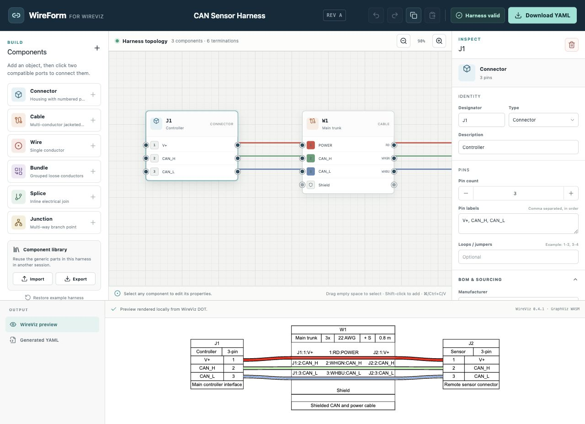

# WireForm

WireForm is a desktop-first visual editor for generating WireViz-compatible
wiring harness YAML. It runs completely in the browser: harness data, YAML
generation, WireViz, Python, and Graphviz rendering remain on the user's
machine.

[Open the WireForm editor](https://garth-42.github.io/WireForm/)



## Features

- Draggable topology canvas with connectors, cables, individual wires, bundles,
  splices, and junctions
- Explicit pin and conductor terminations
- Wire colors, labels, gauge, length, shields, loops, and BOM fields
- Hold and drag to select multiple components
- Move, copy, paste, and delete a component selection
- Undo and redo
- Live validation and deterministic YAML generation
- Versioned editable project files with schema migration
- IndexedDB autosave and recovery, with a local-storage fallback
- Existing WireViz YAML import with a compatibility report
- Persistent named user libraries with template management, duplicate policies,
  selected-template export, and full backup/restore
- Connector photo upload with embedded project/library storage and display on
  both the topology canvas and WireViz-derived preview
- YAML download and component-library import/export
- In-browser preview through vendored WireViz, Pyodide, and Graphviz WebAssembly
- Static deployment with no account, database, application server, or telemetry

## Using the editor

1. Add a connector, cable, wire, bundle, splice, or junction from the left
   panel.
2. Select a component and edit its properties in the right inspector.
3. Select one port and then a compatible port to connect them.
4. Drag on empty canvas space to select several components. Drag any selected
   header to move the group; use <kbd>Ctrl</kbd>/<kbd>⌘</kbd>+<kbd>C</kbd> and
   <kbd>Ctrl</kbd>/<kbd>⌘</kbd>+<kbd>V</kbd> to copy and paste.
5. Optionally upload a connector photo from the connector inspector. WireForm
   resizes it locally and embeds it in the editable project, user-library
   templates, topology canvas, and local WireViz preview.
6. Use the top-bar file controls to create, open, or download an editable
   `.wireform.json` project, or import an existing `.yml`/`.yaml` WireViz file.
7. Review the generated WireViz preview or YAML in the lower panel.
8. Resolve validation errors and choose **Download YAML**.

WireForm autosaves the current editable project in the browser. Download a
`.wireform.json` project for a portable backup. YAML import deliberately shows
a compatibility report before replacing the canvas because comments, aliases,
formatting, and unsupported WireViz fields cannot all be represented visually.
Connector photos remain embedded in WireForm project and library files; a YAML
download does not contain binary image data.

## Local development

Requirements: Node.js 22.13 or newer and npm.

```bash
npm ci
npm run dev
```

The development server prints the local URL. To build and inspect the same
static files that GitHub Pages serves:

```bash
npm run build
npm run preview
```

Before submitting a change:

```bash
npm run vendor:verify
npm run lint
npm test
npm audit --audit-level=high
```

## GitHub Pages deployment

The production build contains only static files and uses relative asset URLs, so
it works under a GitHub Pages project path such as
`https://USERNAME.github.io/REPOSITORY/`.

The included deployment workflow builds and publishes `dist/` whenever `main`
changes. After creating the repository:

1. Push this project to the repository's `main` branch.
2. Open **Settings → Pages**.
3. Set **Source** to **GitHub Actions** if it is not already selected.
4. Follow the **Deploy GitHub Pages** workflow in the Actions tab.

The application does not require GitHub API access after the page loads.

## Browser support and privacy

WireForm targets current desktop releases of Chrome, Edge, Firefox, and Safari.
Web Workers and WebAssembly must be enabled. Directly opening `dist/index.html`
with a `file://` URL is not supported; use `npm run preview` or another static
HTTP server.

Harness autosaves and user libraries are stored in browser-local IndexedDB
(with a local-storage fallback when available). WireForm does not include
analytics or telemetry and does not send project data or photos to a backend.

## Planned features

- Wire-list/table editor
- Verified WireViz updater command
- Optional GitHub repository integration
- Installable offline PWA
- Manufacturer connector catalogs and distributable image packs

The [WireViz updater integration plan](docs/plans/wireviz-updater.md) defines
the proposed command, supply-chain checks, compatibility gates, CI discovery,
and rollback behavior.

## Documentation

- [Architecture](ARCHITECTURE.md)
- [Contributing](CONTRIBUTING.md)
- [Code of conduct](CODE_OF_CONDUCT.md)
- [Security policy](SECURITY.md)
- [Third-party notices](THIRD_PARTY_NOTICES.md)
- [Vendored dependency manifest](vendor/manifest.json)

## License

Copyright © 2026 Garth Benson.

WireForm is licensed under the
[GNU General Public License version 3](LICENSE), identified by the SPDX
expression `GPL-3.0-only`. It vendors and integrates WireViz and other
third-party components under the licenses documented in
[THIRD_PARTY_NOTICES.md](THIRD_PARTY_NOTICES.md).
